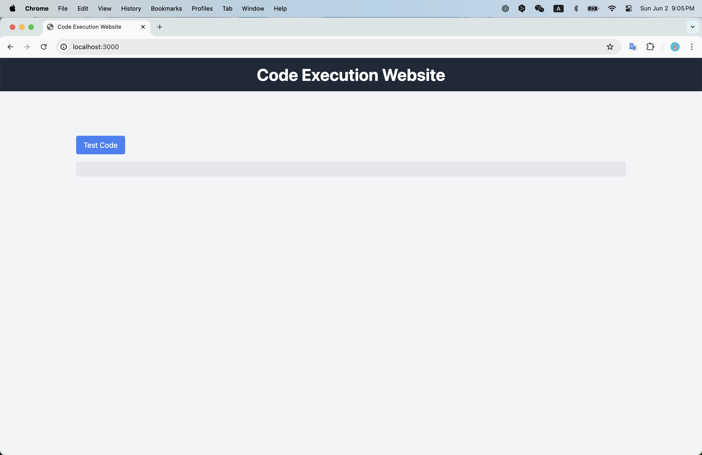

## Notes:

Sadly this website doesn't work as expected :(

I plan to integrate `@uiw/react-codemirror` as the code execution platform (related code located in [CodeEditor.tsx](frontend/src/components/CodeEditor.tsx))

Here is the error consistently occured: 

Unrecognized extension value in extension set ([object Object]).

I've tried to clean up node modules and reinstall; 
directly use `codemirror` to avoid multiple instances of `@codemirror/state` (related code located in [CodeEditor2.tsx](frontend/src/components/CodeEditor2.tsx)). Unfortunately, none of the fixes worked.

## Running the website:

##### Running the backend:
```bash
cd backend
python -m venv venv
source venv/bin/activate  # On Windows use `venv\Scripts\activate`
pip install -r requirements.txt
uvicorn main:app --reload
```

##### Running the frontend:
```bash
cd frontend
npm install
npm run dev
```

When encounter dependency conflicts, consider resolving the conflicts by:
```bash
# Install specific packages with legacy peer dependencies option
npm install @uiw/react-codemirror @codemirror/lang-python --legacy-peer-deps

# If necessary, reinstall all dependencies with legacy peer dependencies option
rm -rf node_modules package-lock.json
npm install --legacy-peer-deps

# As a last resort, force install specific packages
npm install @uiw/react-codemirror @codemirror/lang-python --force
```

## Current Design:
